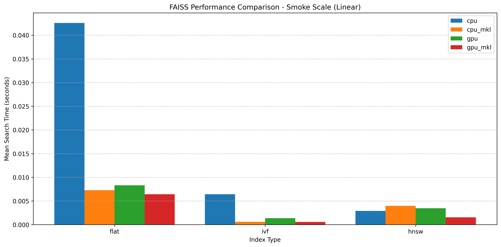

# Building a Python Package of FAISS with MKL and CUDA

This repo is for building a Python wheel from FAISS (Facebook AI Similarity Search).

> "Faiss is a library for efficient similarity search and clustering of dense vectors. It contains algorithms that search
> in sets of vectors of any size, up to ones that possibly do not fit in RAM. It also contains supporting code for
> evaluation and parameter tuning. Faiss is written in C++ with complete wrappers for Python/numpy. Some of the most
> useful algorithms are implemented on the GPU. It is developed primarily at Meta's Fundamental AI Research group." - https://github.com/facebookresearch/faiss

Faiss can be compiled with Intel Math Kernel (MKL) and CUDA libraries, so I have included those build options. Faiss depends on numpy, which can also be compiled with MKL support, so I am doing both of these together for convenience. [^1]

The repo for the faiss package on pypi is this one - https://github.com/kyamagu/faiss-wheels, if you just want to get faiss installed, you probably want that one instead.

## Background

After upgrading my system python to 3.13, I noticed that I wasn't able to "pip install faiss" anymore, so I set about the task of building the package locally. Little did I know, that this would be a week-long rabbit hole involving learning about how to optimize cmake projects with ninja, the complexities of SWIG, benchmarking and the various types of Vector search algorithms.


Ideally it uses the Intel MKL LAPACK and BLAS packages. However, you can build non-mkl packages with `build.sh numpy cpu` or `build.sh numpy gpu`. Currently, the mkl on or off status has to be consistent between both numpy and faiss build type. so the following have been tested:

### A chrts



### Another chart


  

<div id="image-table">
    <table>
	    <tr>
    	    <td style="padding:10px">
        	    
      	    </td>
            <td style="padding:10px">
            	
            </td>
            <td style="padding:10px">
            	
            </td>
        </tr>
    </table>
</div>


## Performance Benchmarks

This project includes comprehensive performance benchmarks to compare different FAISS builds and index types. The benchmarks test search performance across various configurations:

### Build Types
- CPU (without MKL)
- CPU with MKL
- GPU
- GPU with MKL

### Index Types
- Flat (exact search)
- IVF (inverted file index)
- HNSW (hierarchical navigable small world graph)

### Benchmark Results

After running the tests for different build types, a performance comparison plot is generated in `tests/benchmark_results/performance_comparison.png`. This plot shows:

- Mean search time for each index type
- Comparison across all tested build types
- Error bars indicating performance variability

The raw benchmark data is also saved as JSON files in the `tests/benchmark_results/` directory for further analysis.

### Test Configuration

The benchmarks use the following parameters:
- Vector dimension: 128
- Database size: 10,000 vectors
- Query size: 1,000 vectors
- k-NN search: k=10
- Each test is run for multiple rounds

## Virtual Environments

The build scripts create separate virtual environments for each configuration:

- `numpy_venv`: NumPy without MKL
- `numpy_mkl_venv`: NumPy with MKL
- `faiss_cpu_venv`: FAISS CPU-only
- `faiss_cpu_mkl_venv`: FAISS CPU with MKL
- `faiss_gpu_venv`: FAISS with GPU
- `faiss_gpu_mkl_venv`: FAISS with GPU and MKL

For development purposes, you can append `_local` to the environment name by setting the `DEV_LOCAL` environment variable:

```bash
DEV_LOCAL="_local" ./build.sh numpy cpu
```

[^1]: I was originally under the impression that you couldn't run faiss with MKL and vanilla numpy (https://github.com/facebookresearch/faiss/issues/1393#issuecomment-1662335238) however I seemed to be able to run both together. 