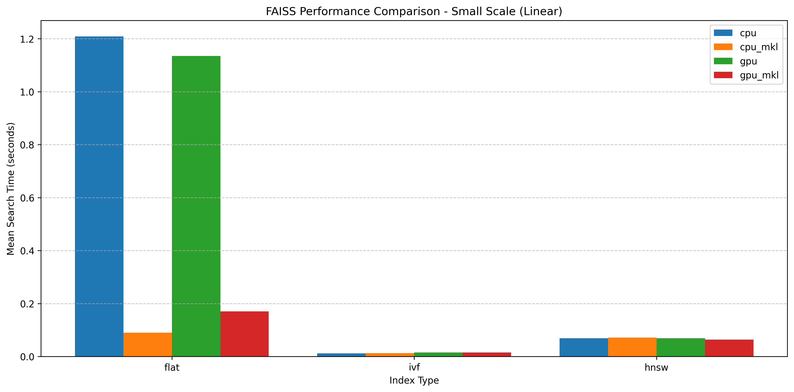

# Python Packaging of FAISS with MKL and CUDA

This repo is for building a Python wheel from FAISS (Facebook AI Similarity
Search).

> "Faiss is a library for efficient similarity search and clustering of dense
> vectors. It contains algorithms that search in sets of vectors of any size,
> up to ones that possibly do not fit in RAM. It also contains supporting code
> for evaluation and parameter tuning. Faiss is written in C++ with complete
> wrappers for Python/numpy.
> also contains
> supporting code for
> evaluation and parameter tuning. Faiss is written in C++ with complete
> wrappers for Python/numpy.
> Some of the most
> Some of the most useful algorithms are implemented on the GPU. It is
> developed primarily at Meta's Fundamental AI Research group."
> - https://github.com/facebookresearch/faiss

Faiss can be compiled with Intel Math Kernel (MKL) and CUDA libraries, so I
have included those build options. Faiss depends on numpy, which can also be
compiled with MKL support, so I am doing both of these together for
convenience. [^1]

The wheel builder repo for the faiss package on pypi is this one -
[faiss-wheels](https://github.com/kyamagu/faiss-wheels), if you just want to get
faiss
installed, you probably want that one instead [^2]. This project is mostly
for collecting my experiments in comparing various build options and index
types on performance under different conditions.

## Background

After upgrading my system python to 3.13, I noticed that I wasn't able to
"pip install faiss" anymore, so I set about the task of building the package
locally. Little did I know, that this would be a week-long rabbit hole
involving learning about how to optimize cmake projects with ninja, the
complexities of SWIG, benchmarking and the various types of Vector search
algorithms.
learning about how to optimize cmake projects with ninja, the complexities of
SWIG, benchmarking and the various types of Vector search algorithms.

---
**NOTE**

I am using Fedora Linux with python 3.13 and docker. Presumably this should
work on macOS and windows, but I didn't test that.

---

## Library dependencies

The cmake configuration for faiss supports options to specify implementations
for dependencies. The two main options that I understood to most affect
performance were the BLAS and GPU configurations. As a result I am building
those variations. i.e. mkl vs openblas and CPU vs GPU, where
following package types

- cpu
- cpu_mkl
- gpu
- gpu_mkl

My assumption is that if you are running nvidia hardware, and you are doing
things that depend on good performance, that you probably have the cuda
runtime libraries available on your system. However for MKL, I thought it
would be a good idea to include the required files as to avoid needing to
install MKL package repos during deployment. However, I run into swig
problems including libraries, so that issue is still outstanding.

### BLAS

Faiss requires a BLAS (Basic Linear Algebra Subprograms) [^3] package to
compile. It will find the OpenBlas libraries if they are installed.

```shell
-- The CXX compiler identification is GNU 14.2.1
-- Detecting CXX compiler ABI info - done
-- Detecting CXX compile features - done
-- Found OpenMP_CXX: -fopenmp (found version "4.5")
-- Found OpenMP: TRUE (found version "4.5")
-- Found Threads: TRUE
-- Could NOT find MKL (missing: MKL_LIBRARIES)
-- Found BLAS: /usr/lib64/libblas.so
-- Found LAPACK: /usr/lib64/liblapack.so;/usr/lib64/libblas.so
```

But the performance can be improved by compiling with MKL instead. MKL is the
Intel oneAPI Math Kernel Library, which is reputed to give significant
improvements for Intel based hardware [^4].

I am calling configure like so

```shell
-DBLA_VENDOR=Intel10_64lp \
-DMKL_LIBRARIES="/opt/intel/oneapi/mkl/2025.1/lib/libmkl_intel_lp64.so \
/opt/intel/oneapi/mkl/2025.1/lib/libmkl_tbb_thread.so \
/opt/intel/oneapi/mkl/2025.1/lib/libmkl_gnu_thread.so \
/opt/intel/oneapi/mkl/2025.1/lib/libmkl_core.so \
/opt/intel/oneapi/mkl/2025.1/lib/libmkl_intel_thread.so \
/opt/intel/oneapi/mkl/2025.1/lib/intel64/libmkl_intel_lp64.so \
/opt/intel/oneapi/compiler/2025.1/lib/libiomp5.so \
/opt/intel/oneapi/mkl/2025.1/lib/libmkl_gf_lp64.so \
/opt/intel/oneapi/tbb/2022.1/lib/libtbb.so"
```

I am not entirely sure if it's using all those shared objects, (for example
libtbb.so seems required to exist, but doesn't get used) but it fails to import
if they are missing, according to my experiments. This unfortunately bloats the
install to many 100s of MB.

With the MKL_LIRARIES and DBLA_VENDOR it find the libraries during configure:

```shell
-- The CXX compiler identification is GNU 14.2.1
-- Detecting CXX compiler ABI info
-- Detecting CXX compiler ABI info - done
-- Check for working CXX compiler: /usr/bin/ccache - skipped
-- Detecting CXX compile features
-- Detecting CXX compile features - done
-- Found OpenMP_CXX: -fopenmp (found version "4.5")
-- Found OpenMP: TRUE (found version "4.5")
-- Performing Test CMAKE_HAVE_LIBC_PTHREAD
-- Performing Test CMAKE_HAVE_LIBC_PTHREAD - Success
-- Found Threads: TRUE
-- Found MKL: /opt/intel/oneapi/mkl/2025.1/lib/libmkl_intel_lp64.so;/opt/intel/oneapi/mkl/2025.1/lib/libmkl_tbb_thread.so; \
  /opt/intel/oneapi/mkl/2025.1/lib/libmkl_gnu_thread.so;\
  /opt/intel/oneapi/mkl/2025.1/lib/libmkl_core.so; \
  /opt/intel/oneapi/mkl/2025.1/lib/libmkl_intel_thread.so; \
  /opt/intel/oneapi/mkl/2025.1/lib/intel64/libmkl_intel_lp64.so; \
  /opt/intel/oneapi/compiler/2025.1/lib/libiomp5.so; \
  /opt/intel/oneapi/mkl/2025.1/lib/libmkl_gf_lp64.so; \
  /opt/intel/oneapi/tbb/2022.1/lib/libtbb.so
-- Found SWIG: /usr/bin/swig (found version "4.2.1") found components: python
-- Found Python: /usr/include/python3.13 (found version "3.13.2") found components: Development NumPy Interpreter Development.Module Development.Embed
-- Configuring done (1.1s)
-- Generating done (0.2s)
-- Build files have been written to: /build/faiss-builder/build/srcs/faiss/_build_numpy_mkl_cpu_mkl
FAISS configuration completed successfully!
```

### CUDA support

Building faiss with cuda libraries (`-DFAISS_ENABLE_GPU=ON`) enables a number of
additional functions in the library:

```python
import faiss

res = faiss.StandardGpuResources()
# Build GPU index
index = faiss.IndexFlatL2(64)
gpu_index = faiss.index_cpu_to_gpu(res, 0, index)
```

Faiss also seems to use GPU implementations of various methods behind the
scenes, if gpu is compiled, which show up in benchmarking comparison.

### Numpy

Faiss depends on numpy, and it will install the pypi vanilla numpy package if
you don't tell it otherwise. Numpy also has a process for building with MKL
libraries [^5], if you want more control. However, the `build.sh` relies on a
local numpy installation for headers during building, so its done a pre-step of
the build process.

Initially I assumed that you must build numpy with mkl to use faiss with mkl due
to [^4], but now I am not so sure. There are two build options for numpy:

- numpy
- numpy_mkl

This results in calling the build module with one of these options

#### numpy

```shell
python -m build <other-args> -Csetup-args=-Dblas=blas -Csetup-args=-Dlapack=lapack
```

#### numpy_mkl

```shell
python -m build <other-args> -Csetup-args=-Dblas=mkl -Csetup-args=-Dlapack=mkl
```

## Basic Usage

### Setup Build environment

I am using a docker container to build the package, so the first step is to
build images to run that environment.

```shell
git clone https://github.com/tolland/docker ~/git/tolland-docker || true
cd ~/git/tolland-docker
# build faiss builder images, with mkl repos and cuda runtime
./build_faiss_builder_images.sh
# This should produce (amongst others) a faiss-builder image of much GB
docker images | grep faiss-builder
# > tolland/fedora-41-faiss-builder   latest    c7d47fd68ec2   3 days ago   8.35GB
```

### Fix directory permissions to avoid docker problems

```shell
# wheels will be built into ./build/dists subdir of current dir
cd ~/git/tolland-docker # so ~/git/tolland-docker/build/dists
# do this first, otherwise docker will create it with root ownership 
mkdir -p ./build/dists
# I also had to change the selinux as it wasn't being labelled correctly
chcon -R -t container_file_t  ./build/dists
```

Then pick the one you want from below:

#### plain faiss

```shell
# you can then do this to build the wheel
docker compose -f ./51_faiss/docker-compose.yml \
  run -it --rm fedora-41-faiss-build \
  ./build.sh numpy cpu
# ... lots of output about config and building ...
# and it will build the wheel into the ./build/dists directory
find  ./build/dists/
build/dists/
build/dists/numpy
build/dists/numpy/numpy-2.2.4.tar.gz
build/dists/numpy/numpy-2.2.4-cp313-cp313-linux_x86_64.whl
build/dists/faiss_numpy_cpu
build/dists/faiss_numpy_cpu/faiss-1.10.0-py3-none-any.whl
```

If you just want faiss (no mkl), then you can just install that wheel above,
and be done with it.

```shell
python -mvenv tmpvenv
source ./tmpvenv/bin/activate
pip install build/dists/faiss_numpy_cpu/faiss-1.10.0-py3-none-any.whl
# > Looking in indexes: https://.../root/pypi/+simple/, https://.../root/pypi_ngc_nvidia
# > Processing ./build/dists/faiss_numpy_cpu/faiss-1.10.0-py3-none-any.whl
# > Collecting numpy (from faiss==1.10.0)
# >   Downloading https://.../root/pypi/%2Bf/bce/43e386c16898b/numpy-2.2.4-cp313-cp313-manylinux_2_17_x86_64.manylinux2014_x86_64.whl (16.1 MB)
# >      ━━━━━━━━━━━━━━━━━━━━━━━━━━━━━━━━━━━━━━━━ 16.1/16.1 MB 20.6 MB/s eta 0:00:00
# > Requirement already satisfied: packaging in ./tmpvenv/lib64/python3.13/site-packages (from faiss==1.10.0) (25.0)
# > Installing collected packages: numpy, faiss
# > Successfully installed faiss-1.10.0 numpy-2.2.4

# > [notice] A new release of pip is available: 24.2 -> 25.0.1
# > [notice] To update, run: pip install --upgrade pip
python -c "import faiss ; print(faiss.__version__)"
# > 1.10.0
```

However, if you want mkl as well, then the build

#### numpy and faiss with MKL

```shell
docker compose -f ./51_faiss/docker-compose.yml \
  run -it --rm fedora-41-faiss-build \
  ./build.sh numpy_mkl cpu_mkl
# ... lots of output about config and building ...
# and it will build the wheel into the ./build/dists directory
find  ./build/dists/
build/dists/
build/dists/numpy_mkl
build/dists/numpy_mkl/numpy-2.2.4.tar.gz
build/dists/numpy_mkl/numpy-2.2.4-cp313-cp313-linux_x86_64.whl
build/dists/faiss_numpy_mkl_cpu_mkl
build/dists/faiss_numpy_mkl_cpu_mkl/faiss-1.10.0-py3-none-any.whl
```

Then you will need to install both of those packages, and also install the
MKL libraries into your system using the MKL installation instructions. [^6]

If you also want GPU support, then you can do this

#### numpy and faiss with MKL, cuda support

```shell
docker compose -f ./51_faiss/docker-compose.yml \
  run -it --rm fedora-41-faiss-build \
  ./build.sh numpy_mkl gpu_mkl
# ... lots of output about config and building ...
```

#### numpy and faiss cuda support

So for completeness, we have a gpu only package.

```shell
docker compose -f ./51_faiss/docker-compose.yml \
  run -it --rm fedora-41-faiss-build \
  ./build.sh numpy gpu
```

## Benchmarks

So now we have 4 different varieties of faiss package, which can be compared for
performance under different conditions

- cpu
- cpu_mkl
- gpu
- gpu_mkl

There are a number of sources of python faiss code that can be used to exercise
faiss for benchmarking and testing. They have some tutorial files
here: <https://github.com/facebookresearch/faiss/tree/main/tutorial/python>

These build various indexes, so can be used as a basis for benchmarking. They
also have a test suite
here <https://github.com/facebookresearch/faiss/tree/main/tests>

I pulled the basic examples for each of the main index types into a pytest file
and ran them under pytest-benchmark, which produced these initial results:

### Simple index searching



That seems pretty reasonable. The MKL libraries are a substantial benefit when
using flat `faiss.IndexFlatL2` index for searching. Interesting though that the
cpu_mkl beats the gpu_mkl for the flat index.

---

## Footnotes

[^1]: I was originally under the impression that you couldn't run faiss with MKL
and vanilla
numpy (https://github.com/facebookresearch/faiss/issues/1393#issuecomment-1662335238)
however I seemed to be able to run both together when I did try. However, I
excluded those combinations (vanilla numpy and mkl faiss) from most of the
benchmarking and testing based on that assumption. That said, if you have gone
to the effort of installing MKL dependencies, you might as well do both.

[^2]: I had spent a while trying various build and packaging options before it
occured to me to go and look and see how they were doing it.

[^3]: https://netlib.org/blas/

[^4]: https://en.wikipedia.org/wiki/Math_Kernel_Library - "function detects a
non-Intel CPU, it almost always chooses the most basic (and slowest) function to
use, regardless of what instruction sets the CPU claims to support. This has
netted the system a nickname of "cripple AMD" routine since 2009."

[^5]: <https://numpy.org/doc/stable//building/blas_lapack.html>

[^6]: <https://www.intel.com/content/www/us/en/developer/tools/oneapi/onemkl-download.html?operatingsystem=linux&linux-install=offline>
So there is probably a subset of MKL to install to get this to run, but I
haven't done the work to determine that yet.
